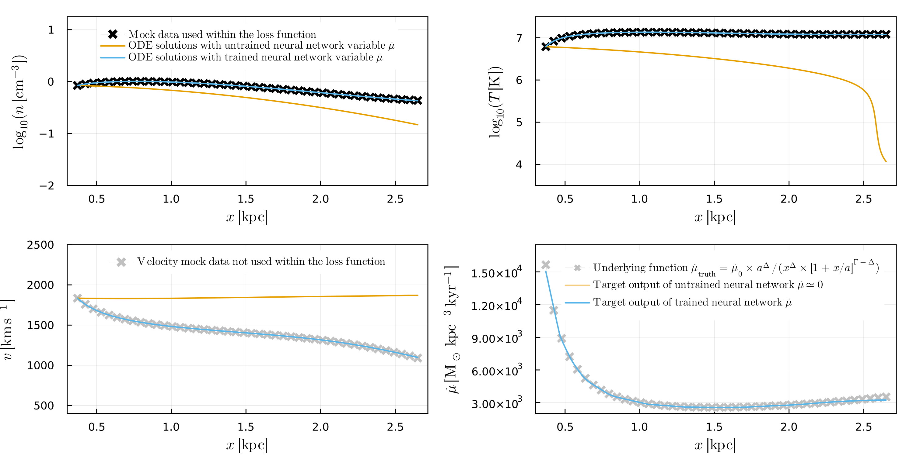
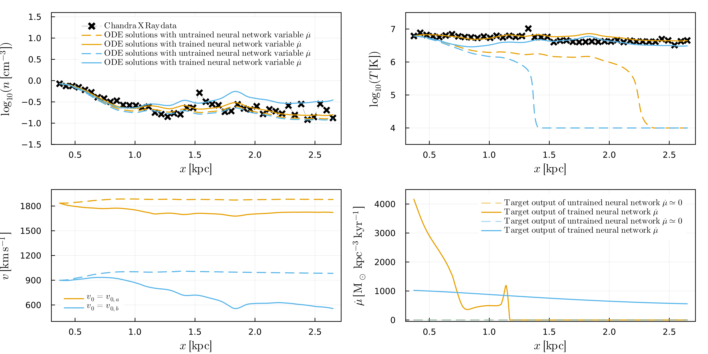

# 2023_NeurIPS_PhysicalSciencesWorkshopPaper_NeuralODEsForM82

The paper can be found at: 

Additional details on neural galactic winds can be found in my first [paper](https://ml4astro.github.io/icml2023/assets/16.pdf). 

Plot of un-trained and trained neural ODE model applied towards mock data: 

Plot of un-trained and trained neural ODE model applied towards M82 data for two velocity guesses. 

This repository contains the source `julia`` code alongside the Jupyter notebooks used to make many of the plots in the paper. There are two repositories: one for the mock data test and another for the comparison to M82 data. 

Please note, that the uniform `Glorot` inialization of the neural network has some randomness and there is not a specific key that is used for exact reproducability when running the code. To exactly reproduce the initialization I used in the paper, you can extract the saved neural networks parameters from the first line of the `p_ADAM.jld2` file, which represents the untrained model in the paper. In most cases, the default Glorot initialization should give results that look identical to mine.

Below is an animation of the optimization over different epochs for the mock test: 

[View animation](https://dustindnguyen.com/image/movie_neurips.mp4)

